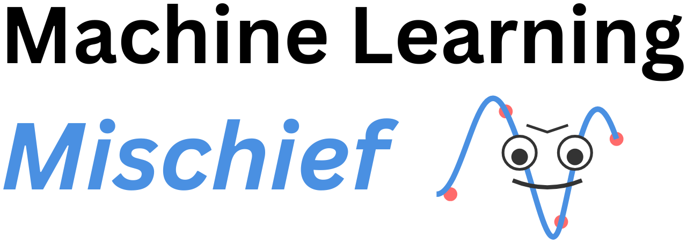

# Machine Learning Mischief

_It is possible to "bend" machine learning experiments towards achieving a preconceived goal?_

This involves systematically exploiting evaluation metrics and/or scientific tests to achieve desired outcomes without actually meeting the underlying scientific objectives.

These behaviors are _unethical_ and might be called [_cherry picking_](https://en.wikipedia.org/wiki/Cherry_picking), [_data dredging_](https://en.wikipedia.org/wiki/Data_dredging), or _gaming results_.

Reviewing examples of this type of "gaming" (data science dark arts) can remind beginners and stakeholders (really all of us!) why certain methods are best practices and how to avoid being deceived by results that are too good to be true.

## Examples

Below are examples of this type of gaming, and simple demonstrations of each:

* [Seed Hacking](examples/seed_hacking.md): _Repeat an experiment with different random number seeds to get the best result._
	* [Cross-Validation Hacking](examples/cross_validation_hacking.md): _Vary the seed for creating cross-validation folds in order to get the best result._
	* [Train/Test Split Hacking](examples/train_test_split_hacking.md): _Vary the seed for creating train/test splits in order to get the best result._
	* [Model Selection Hacking](examples/model_selection_hacking.md): _Vary the seed for the model training algorithm in order to get the best result._
	* [Performance Hacking](examples/performance_hacking.md): _Vary the seed for a bootstrap evaluation of a final chosen model on the test set to present the best performance._
* [p-Hacking](examples/p_hacking.md): _Repeat a statistical hypothesis test until a significant result is achieved._
* [Test Set Memorization](examples/test_set_memorization.md): _Allow the model to memorize the test set and get a perfect score._
* [Test Set Overfitting](examples/test_set_overfitting.md): _Optimizing a model for its performance on a "hold out" test set._
* [Test Set Pruning](examples/test_set_pruning.md): _Remove hard-to-predict examples from the test set to improve results._
* [Train/Test Split Ratio Gaming](examples/train_test_ratio_gaming.md): _Vary train/test split ratios until a desired result is achieved._
* [Leaderboard Hacking](examples/leaderboard_hacking.md): _Issue predictions for a machine learning competition until a perfect score is achieved._
* [Threshold Hacking](examples/threshold_hacking.md): _Adjusting classification thresholds to hit specific metric targets._

## How To Spot

Results presented using these methods are easy to spot with probing questions:

* "_Why did you use such a specific random number seed?_"
* "_Why did you choose this split ratio over other more common ratios?_"
* "_Why did you remove this example from the test set and not that example?_"
* "_Why didn't you report a performance distribution over repeated resampling of the data?_"

All this highlights that the choices in an experimental method must be defensible! Especially those that deviate from widely adopted heuristics.

## DO NOT DO THIS

This project is for **educational purposes only**!

If you use these methods on a project, you're unethical, a fraud, and your results are garbage. You're garbage.

### So why give examples?

I've never seen anything like this for machine learning and data science. Yet, most experienced practitioners know that they are a _real thing_.

Knowing what-to-look-for can help stakeholders, managers, teachers, paper reviews, etc.

Knowing what-not-to-do can help junior data scientists.

Also, thinking about and writing these examples feels naughty + fun :)

## More

See the related ideas of [magic numbers](https://en.wikipedia.org/wiki/Magic_number_(programming)), [researcher degrees of freedom](https://en.wikipedia.org/wiki/Researcher_degrees_of_freedom), and [forking paths problem](https://en.wikipedia.org/wiki/Forking_paths_problem).

See this more general paper [Big little lies: a compendium and simulation of p-hacking strategies](https://royalsocietypublishing.org/doi/10.1098/rsos.220346), 2023.

If you like this project, you may be interested in [Data Science Diagnostics](https://DataScienceDiagnostics.com).

If you have ideas for more examples, email me: Jason.Brownlee05@gmail.com (you won't, that's okay)

